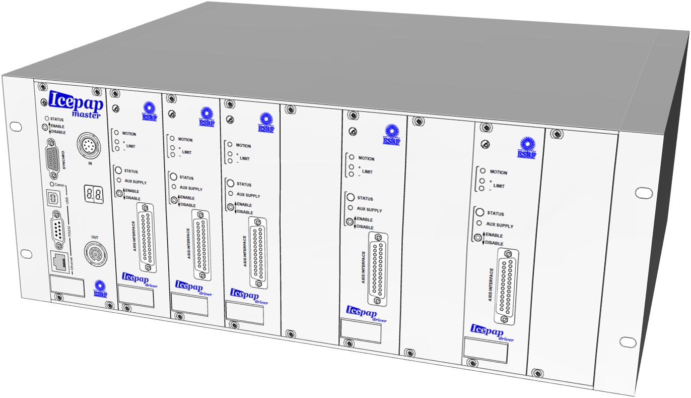

.. EDNA-ALBA documentation master file, created by
   sphinx-quickstart on Thu Feb 23 10:16:17 2017.
   You can adapt this file completely to your liking, but it should at least
   contain the root `toctree` directive.

Welcome to IcePAP's documentation!
=====================================

**icepap** is python library (written in python 3.5) that provides access
control and monitor to IcePAP systems.

----

.. toctree::
   :maxdepth: 1

   api
   low_level_methods
   applications

Indices and tables
==================

* :ref:`genindex`
* :ref:`modindex`
* :ref:`search`

